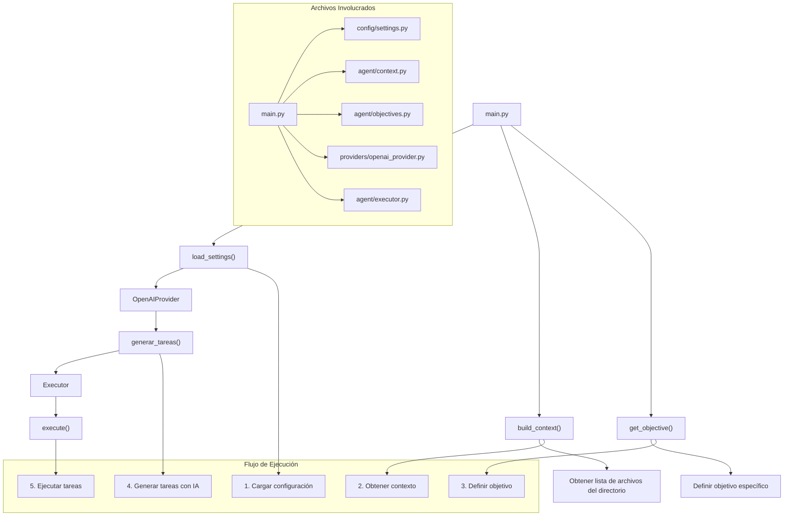

# Flujo de Ejecución del Proyecto Agent General

## Diagrama de Flujo

## Descripción del Flujo

### Archivos Principales
- `main.py`: Punto de entrada principal
- `config/settings.py`: Gestión de configuraciones
- `agent/context.py`: Manejo de contexto
- `agent/objectives.py`: Definición de objetivos
- `providers/openai_provider.py`: Interacción con IA
- `agent/executor.py`: Ejecución de tareas

### Pasos de Ejecución
1. **Cargar Configuración**: 
   - Obtiene configuraciones y clave de API de OpenAI
2. **Obtener Contexto**: 
   - Recopila información contextual (lista de archivos)
3. **Definir Objetivo**: 
   - Convierte la solicitud en un objetivo estructurado
4. **Generar Tareas con IA**: 
   - Descompone el objetivo en tareas específicas
5. **Ejecutar Tareas**: 
   - Procesa y ejecuta cada tarea generada

## Notas
- El diagrama muestra el flujo de control desde `main.py`
- Cada módulo tiene una responsabilidad específica
- La IA (OpenAI) ayuda a descomponer objetivos en tareas